<div align="center">



<a href="https://www.linkedin.com/in/imnmuqri">
  
</a>

<a href="mailto:imanmukri555@gmail.com"></a>
<a href="https://www.linkedin.com/in/imnmuqri"></a>


<br/><br/>
<sub>░▒▓█▓▒░ ░▒▓█▓▒░ ░▒▓█▓▒░ ░▒▓█▓▒░ ░▒▓█▓▒░ ░▒▓█▓▒░ ░▒▓█▓▒░ ░▒▓█▓▒░ ░▒▓█▓▒░</sub>

</div>

## ░▒▓ `whoami`

```
  matrix.sh — boot log (light mode build)

  [ 0.001 ]  opening connection ............  ok
  [ 0.014 ]  decrypting identity ...........  Iman Muqri  @ImnMuqri
  [ 0.026 ]  assigning role ................  Frontend Developer
  [ 0.038 ]  loading native tongue .........  Vue . TypeScript . Vuetify
  [ 0.047 ]  mounting /interests ...........  4 processes attached
  [ 0.055 ]  fetching updates ..............  React, ASP.NET incoming
  [ 0.061 ]  locating spoon ................  no such file or directory
  [ 0.070 ]  red pill ......................  swallowed

  connection established. welcome.
```

<div align="center">
<sub>░▒▓█▓▒░ ░▒▓█▓▒░ ░▒▓█▓▒░ ░▒▓█▓▒░ ░▒▓█▓▒░ ░▒▓█▓▒░ ░▒▓█▓▒░ ░▒▓█▓▒░ ░▒▓█▓▒░</sub>
</div>

## ░▒▓ `ps aux` — what's running

| PID | PROCESS | LOAD | STATE |
|:---:|:---|:---|:---:|
| `001` | **frontend development** — the part users actually touch | `██████████` | 🟢 running |
| `002` | **modern web technologies** — chasing what shipped last week | `████████░░` | 🟢 running |
| `003` | **new frameworks & libraries** — opening every door | `███████░░░` | 🟢 running |
| `004` | **responsive, dynamic apps** — one layout, every screen | `█████████░` | 🟢 running |

## ░▒▓ `apt install` — currently downloading

| MODULE | PROGRESS | NOTE |
|:---|:---|:---|
| **React** | `▰▰▰▱▱▱▱▱▱▱` `30%` | beginner — coming from Vue, so the mental model is rewiring |
| **Node.js** | `▰▰▰▰▰▱▱▱▱▱` `50%` | server-side JavaScript, one endpoint at a time |
| **ASP.NET** | `▰▰▱▱▱▱▱▱▱▱` `20%` | fresh territory, C# and all |

<div align="center">
<sub>░▒▓█▓▒░ ░▒▓█▓▒░ ░▒▓█▓▒░ ░▒▓█▓▒░ ░▒▓█▓▒░ ░▒▓█▓▒░ ░▒▓█▓▒░ ░▒▓█▓▒░ ░▒▓█▓▒░</sub>
</div>

## ░▒▓ `cat stack.json`

<div align="center">

**FRONTEND**

    

**BACKEND**

 

**DATABASES**

 

**SHIPPING**

 

<br/>
<sub>░▒▓█▓▒░ ░▒▓█▓▒░ ░▒▓█▓▒░ ░▒▓█▓▒░ ░▒▓█▓▒░ ░▒▓█▓▒░ ░▒▓█▓▒░ ░▒▓█▓▒░ ░▒▓█▓▒░</sub>

</div>

## ░▒▓ `./contact`

```
visitor@github:~$ ./contact --iman

  ->  email      imanmukri555@gmail.com
  ->  linkedin   /in/imnmuqri
  ->  status     open to collaborate, or just talk tech
  _
```

<div align="center">

<a href="mailto:imanmukri555@gmail.com"></a>
<a href="https://www.linkedin.com/in/imnmuqri"></a>

<br/><br/>
<sub>░▒▓█▓▒░ ░▒▓█▓▒░ ░▒▓█▓▒░ ░▒▓█▓▒░ ░▒▓█▓▒░ ░▒▓█▓▒░ ░▒▓█▓▒░ ░▒▓█▓▒░ ░▒▓█▓▒░</sub>

</div>

## ░▒▓ `htop` — the numbers

<div align="center">


<br/>
<sub>░▒▓█▓▒░ ░▒▓█▓▒░ ░▒▓█▓▒░ ░▒▓█▓▒░ ░▒▓█▓▒░ ░▒▓█▓▒░ ░▒▓█▓▒░ ░▒▓█▓▒░ ░▒▓█▓▒░</sub>

</div>

<details>
<summary><b>░▒▓ decrypt — the source of this profile</b></summary>

<br/>

The rain up top is not a GIF and not an image service. It's a hand-written animated SVG in
`matrix-hero.svg` — CSS keyframes living inside the file itself, which GitHub happily renders.

It also runs the Matrix backwards. The original is glowing phosphor on black, where the leading
character is the **brightest** point. Light mode can't do that, so the rain here behaves like
**ink bleeding down paper** — the leading character is the **darkest**, and the trail fades
*upward* into white. Same physics, opposite medium.

Free to borrow. Swap the name in the hero, keep the rain.

```
There is no spoon.
There is only npm run dev.
```

</details>

<div align="center">
<br/>
<sub>built in light mode, because the real red pill is a white background at 2am</sub>
</div>
